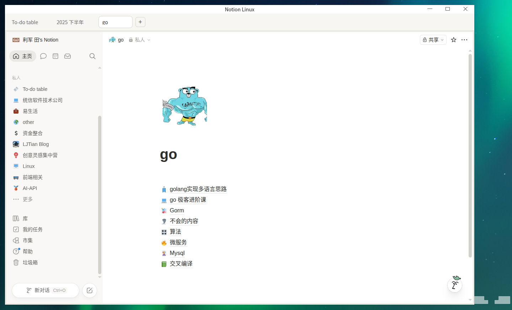

# Notion Linux

基于 Electron 的 Notion Linux 客户端，支持单窗口多标签。

本项目当前**只推荐 AppImage 方式**使用与分发。

## 效果图



## 推荐安装（AppImage）

1. 打开 Releases 页面下载对应架构的 AppImage：  
   <https://github.com/LJTian/notion-linux/releases/latest>
2. 给文件增加可执行权限并启动：

```bash
chmod +x notion-linux-x64.AppImage
./notion-linux-x64.AppImage
```

> `arm64` 用户请下载并运行 `notion-linux-arm64.AppImage`。


## 本地开发与构建

要求：Node.js 20+

```bash
npm install
npm run dev
```

构建 AppImage：

```bash
# x64
make dist-appimage

# arm64
make dist-appimage LINUX_ARCH=arm64
```

产物文件：

- `notion-linux-x64.AppImage`
- `notion-linux-arm64.AppImage`

## 网络与镜像（中国大陆）

```bash
npm install --registry=https://registry.npmmirror.com --electron_mirror=https://npmmirror.com/mirrors/electron/
make dist-appimage NPM_REGISTRY=https://registry.npmmirror.com ELECTRON_MIRROR=https://npmmirror.com/mirrors/electron/
```

## 可调构建参数

```bash
make dist-appimage ELECTRON_VERSION=38.2.0
make dist-appimage NOTION_USER_AGENT='Mozilla/5.0 ... Chrome/140.0.0.0 Safari/537.36'
```

## 已知问题

- root 用户运行开发模式请加参数：`npm run dev -- --no-sandbox`
- 无图形环境（无 `DISPLAY`）无法直接启动 Electron
- 如遇 GPU 渲染问题可尝试 `--disable-gpu`

## 免责声明

- 本仓库与 Notion 公司无关联，未获授权背书。
- 软件按“现状”提供，不提供任何明示或默示担保。
- 使用者需自行遵守 Notion 服务条款及相关法律法规。
